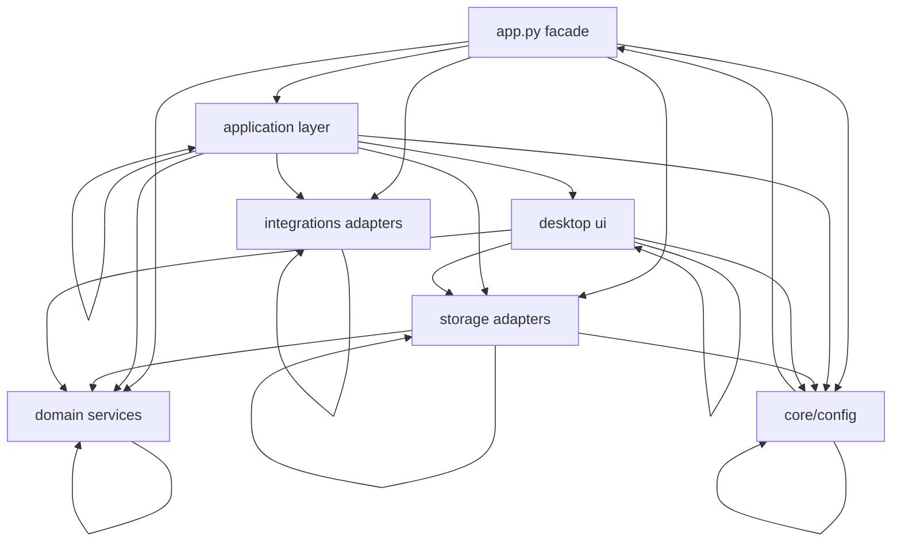

# PROJECT_MAP

Generated at: `2026-02-22 10:54:35 UTC`

This document is generated and maintained from the codebase. Detailed machine-generated artifacts live in `docs/project-map/`.

## 1) High-Level Architecture

Runtime model:
- `app.py` is the compatibility facade and process bootstrap.
- `kokoro_tts.application` orchestrates state, ports, and service wiring.
- `kokoro_tts.domain` contains normalization, splitting, style, voice, morphology, and expression logic.
- `kokoro_tts.storage` handles local files plus SQLite persistence/export.
- `kokoro_tts.integrations` wraps model loading, ffmpeg setup, and GPU forwarding.
- `kokoro_tts.ui` hosts the Tkinter desktop interface and feature modules.

## 2) Directory Map

- `.github`: CI workflow configuration.
- `data`: Runtime data files (pronunciation rules, local NLP assets).
- `docs`: Project architecture and generated mapping artifacts.
- `kokoro_tts`: Main package with layered runtime modules.
- `scripts`: Operational and diagnostic scripts.
- `tests`: Unit/integration/UI and contract tests.
- `app.py`: top-level runtime or project metadata file.
- `README.md`: top-level runtime or project metadata file.
- `requirements-dev.txt`: top-level runtime or project metadata file.
- `requirements.txt`: top-level runtime or project metadata file.

Detailed tree: `docs/project-map/structure.txt`

## 3) Entry Points & Lifecycle

- Primary entrypoint: `app.py` (`launch()` for desktop runtime).
- Module launcher: `kokoro_tts/main.py` calls `app.launch()`.
- Startup flow:
1. `load_config()` -> build `AppConfig`.
2. `setup_logging()` + ffmpeg discovery.
3. Build `AppContext`.
4. `initialize_app_services()` wires model manager, repositories, app state, history service, and Tkinter UI.
5. App facade functions (`generate_first`, `generate_all`, `predict`, `tokenize_first`) delegate through `LocalKokoroApi`.
- Background work:
- Optional morphology async ingest uses a single-worker `ThreadPoolExecutor`.
- Optional TTS prewarm can run sync or async thread (`tts-prewarm`).

## 4) Dependency Graph Overview

- Internal module edges discovered: `129`
- Layer edges discovered: `22`
- Artifacts:
- `docs/project-map/deps-graph.mmd`
- `docs/project-map/deps-graph.tsv`
- Dependency direction is primarily inward from `app/ui` -> `application` -> `domain/storage/integrations`.

## 5) Configuration & Environment

- Environment variables are loaded via `os.getenv` and script process environment injection.
- Primary config aggregation: `kokoro_tts/config.py::load_config`.
- Secret handling:
- Optional `HF_TOKEN` read from environment only (not committed).
- `.env` is ignored by git; `.env.example` documents non-secret defaults.
- Full catalog with defaults and references: `docs/project-map/env.md`.

## 6) Data Model

- SQLite morphology database (optional) at `MORPH_DB_PATH`.
- Core tables (prefix configurable):
- `*_lexemes`
- `*_token_occurrences`
- `*_expressions`
- Pronunciation dictionary stored as JSON map at `PRONUNCIATION_RULES_PATH`.
- Schema details: `docs/project-map/schema.md`.

## 7) Critical Business Flows

- Text generation flow:
1. UI/app wrapper receives text + generation settings.
2. `LocalKokoroApi` resolves voice and delegates to `KokoroState`.
3. `KokoroState` preprocesses text, performs model inference (CPU/GPU), post-processes audio, writes output.
- Pronunciation dictionary flow:
1. Repository loads/parses rules JSON.
2. `ModelManager` applies rules to language pipeline lexicons.
3. UI and app wrappers allow load/apply/import/export at runtime.
- Morphology flow (when enabled):
1. Dialogue segments are tokenized and optionally expression-analyzed.
2. Rows are inserted into SQLite with dedup/ignore semantics.
3. UI exposes read-only browsing and export.

## 8) Testing Map

- Test roots:
- `tests/app`
- `tests/application`
- `tests/config`
- `tests/contracts`
- `tests/domain`
- `tests/integrations`
- `tests/scripts`
- `tests/storage`
- `tests/support`
- `tests/ui`
- Commands:
- `python -m pytest -q`
- `python -m pytest --cov=kokoro_tts --cov=app --cov-report=term-missing -q`
- `ruff check .`
- `mypy`

Supplemental artifacts:
- Route map: `docs/project-map/routes.md`
- Performance summary: `docs/project-map/performance.md`
